# Target Architecture: Multirepo and Service Evolution

## Objetivo

Definir a arquitetura alvo para evoluir o SmartCashFlow do monorepo MVP atual
para uma organizacao multirepo preparada para produto completo, sem antecipar
complexidade operacional antes de os dominios estarem maduros.

Este documento orienta:

- quais repositorios fazem sentido;
- quais dominios devem permanecer juntos no inicio;
- qual ordem de extracao reduz risco;
- quais contratos precisam existir antes de separar servicos;
- como evoluir as telas do prototipo sem bloquear em microservicos prematuros.

## Contexto Atual

O repositorio atual e um monorepo MVP com:

- `frontend/`: React, TypeScript, Vite, Recharts e Lucide.
- `backend/`: FastAPI, SQLAlchemy, Alembic e pytest.
- `infra/`: Terraform e documentacao de deploy.
- `aidlc-docs-bkp/`: documentos AI-DLC e prototipos visuais do produto final.

O backend atual ja cobre:

- autenticacao local/Supabase;
- usuario e workspace;
- upload e preview de TXT/CSV;
- parsing e persistencia de importacoes;
- deduplicacao por arquivo e por transacao;
- transacoes manuais e importadas;
- categorias e subcategorias;
- regras deterministicas de categorizacao;
- revisao de classificacao;
- indicadores de dashboard;
- leitura inicial de cartao de credito por dados importados.

O frontend atual ja cobre telas funcionais para:

- visao geral;
- fluxo de caixa;
- cartoes;
- importacoes;
- transacoes;
- categorias;
- regras;
- revisao;
- configuracoes.

O prototipo alvo adiciona ou aprofunda:

- calendario financeiro;
- orcamentos;
- metas;
- planejamento e projecao;
- investimentos;
- patrimonio;
- relatorios;
- insights IA;
- cenarios e simulador;
- familia e membros;
- assinatura e planos;
- preferencias financeiras avancadas.

## Principio Arquitetural

O caminho recomendado e:

1. Modularizar o monolito atual por dominios.
2. Criar contratos claros entre modulos.
3. Evoluir o produto visual e funcional por fatias.
4. Extrair servicos apenas quando houver necessidade concreta.

Isso evita criar muitos repositorios pequenos antes de haver contratos estaveis,
observabilidade, deploy independente e ownership claro.

## Arquitetura Alvo

```mermaid
flowchart LR
  Web["smartcashflow-web"]
  Mobile["smartcashflow-mobile futuro"]
  Api["smartcashflow-api BFF"]

  Identity["identity-service"]
  Ledger["ledger-service"]
  Import["import-service"]
  Planning["planning-service"]
  Insights["insights-service"]
  Wealth["wealth-service"]
  Billing["billing-service"]
  Notify["notification-service"]

  Contracts["smartcashflow-contracts"]
  Infra["smartcashflow-infra"]

  Db[("PostgreSQL")]
  Storage[("Object Storage")]
  Queue["Queue/Event Bus"]
  Llm["LLM Provider"]
  Payments["Payment Provider"]

  Web --> Api
  Mobile --> Api

  Api --> Identity
  Api --> Ledger
  Api --> Import
  Api --> Planning
  Api --> Insights
  Api --> Wealth
  Api --> Billing

  Contracts -.-> Web
  Contracts -.-> Api
  Contracts -.-> Identity
  Contracts -.-> Ledger
  Contracts -.-> Import
  Contracts -.-> Planning
  Contracts -.-> Insights
  Contracts -.-> Wealth
  Contracts -.-> Billing

  Infra -.-> Api
  Infra -.-> Identity
  Infra -.-> Ledger
  Infra -.-> Import
  Infra -.-> Planning
  Infra -.-> Insights
  Infra -.-> Wealth
  Infra -.-> Billing

  Identity --> Db
  Ledger --> Db
  Import --> Db
  Planning --> Db
  Insights --> Db
  Wealth --> Db
  Billing --> Db

  Import --> Storage
  Import --> Queue
  Queue --> Ledger
  Queue --> Insights
  Queue --> Notify

  Insights --> Llm
  Billing --> Payments
```



## Repositorios Alvo

### smartcashflow-web

Aplicacao web React/Vite.

Responsabilidades:

- experiencia autenticada;
- telas do prototipo;
- design system;
- consumo da API publica/BFF;
- estados de loading, erro e vazio;
- roteamento e autorizacao visual por papel.

Primeira extracao recomendada: sim.

Motivo:

- o frontend ja e uma fronteira natural;
- pode evoluir visualmente sem acoplar ao backend;
- facilita deploy independente em Amplify, S3/CloudFront ou alternativa futura.

### smartcashflow-api

BFF/API publica do produto.

Responsabilidades:

- expor API estavel para frontend/mobile;
- validar autenticacao;
- resolver workspace ativo;
- orquestrar chamadas a modulos/servicos;
- aplicar politicas de autorizacao de alto nivel;
- manter compatibilidade de endpoints durante migracoes.

Primeira extracao recomendada: sim, mantendo o backend atual como base.

Motivo:

- reduz quebra para o frontend;
- permite extrair servicos internos aos poucos;
- preserva velocidade do MVP.

### smartcashflow-contracts

Contratos compartilhados entre repos.

Responsabilidades:

- OpenAPI por dominio;
- schemas JSON;
- eventos assincronos;
- exemplos de payload;
- versionamento de contratos;
- geracao futura de clients/tipos.

Primeira extracao recomendada: sim.

Motivo:

- multirepo sem contratos vira integracao por memoria;
- reduz risco de quebra silenciosa;
- ajuda CI e testes de contrato.

### smartcashflow-infra

Infraestrutura como codigo.

Responsabilidades:

- Terraform;
- ambientes;
- IAM/OIDC;
- storage;
- filas;
- observabilidade;
- dominios;
- secrets por ambiente;
- pipelines.

Primeira extracao recomendada: sim, depois de estabilizar contratos iniciais.

Motivo:

- infraestrutura tem ciclo e permissoes diferentes do codigo de produto;
- separa risco de deploy de app e de cloud.

### smartcashflow-identity-service

Usuarios, workspaces, familia e permissoes.

Responsabilidades:

- usuario;
- workspace;
- membros;
- papeis;
- convites;
- preferencias de conta;
- compatibilidade com Supabase, Cognito ou outro provedor.

Extracao recomendada: fase 2 ou 3.

Motivo:

- hoje o dominio e pequeno;
- a extracao fica mais valiosa quando familia/membros e permissoes avancarem.

### smartcashflow-ledger-service

Livro financeiro operacional.

Responsabilidades:

- transacoes;
- categorias;
- regras de categorizacao;
- revisao;
- normalizacao;
- dedupe logico de transacoes;
- consultas por periodo, texto, origem, categoria e direcao;
- base para indicadores financeiros.

Extracao recomendada: fase 2.

Motivo:

- e o core financeiro;
- quase todas as telas dependem dele;
- deve ter contratos fortes antes de outros dominios crescerem.

### smartcashflow-import-service

Ingestao de dados financeiros.

Responsabilidades:

- upload;
- preview;
- classificacao de arquivo;
- parsers TXT/CSV/PDF futuro;
- armazenamento do arquivo original;
- import jobs;
- erros por linha;
- dedupe de arquivo;
- publicacao de eventos de importacao concluida.

Extracao recomendada: primeiro servico real.

Motivo:

- upload e parsing tem perfil de carga diferente;
- processamento pode virar assincrono com fila;
- PDF futuro pode exigir bibliotecas e tempo de execucao proprios.

### smartcashflow-planning-service

Planejamento financeiro familiar.

Responsabilidades:

- calendario financeiro;
- orcamentos;
- metas;
- projecoes;
- recorrencias planejadas;
- cenarios simples;
- eventos financeiros futuros.

Extracao recomendada: fase 3.

Motivo:

- corresponde a varias telas novas do prototipo;
- pode comecar dentro do backend atual com modelos simples;
- deve extrair quando houver regras proprias suficientes.

### smartcashflow-insights-service

IA, insights e Copilot.

Responsabilidades:

- alertas inteligentes;
- score financeiro explicavel;
- chat financeiro;
- safe spend;
- simulacao assistida por IA;
- otimizacao de orcamento;
- controle de prompts;
- auditoria de respostas;
- limites de custo e timeout.

Extracao recomendada: antes de qualquer LLM em producao.

Motivo:

- IA exige isolamento de custo e seguranca;
- prompts e logs nao podem vazar dados financeiros;
- respostas devem ser auditaveis e rastreaveis.

### smartcashflow-wealth-service

Patrimonio e investimentos.

Responsabilidades:

- ativos;
- passivos;
- patrimonio liquido;
- investimentos;
- alocacao;
- rentabilidade;
- historico patrimonial.

Extracao recomendada: fase 4.

Motivo:

- dominio diferente de fluxo de caixa;
- pode evoluir depois que planejamento e dados operacionais estiverem solidos.

### smartcashflow-billing-service

Planos, assinatura e cobranca.

Responsabilidades:

- plano atual;
- invoices;
- alteracao de plano;
- cancelamento;
- integracao com provedor de pagamento;
- webhooks de pagamento;
- limites por plano.

Extracao recomendada: fase 4 ou antes de monetizacao publica.

Motivo:

- depende de integracao externa sensivel;
- deve ter isolamento de permissao e logs;
- nao deve ficar acoplado ao core financeiro.

### smartcashflow-notification-service

Notificacoes e lembretes.

Responsabilidades:

- notificacoes in-app;
- email;
- alertas de vencimento;
- alertas de risco;
- lembretes de importacao;
- preferencias de canal.

Extracao recomendada: opcional, apos eventos e filas.

Motivo:

- pode nascer como modulo interno;
- fica valioso quando houver calendario, recorrencias, metas e billing.

## Bounded Contexts

### Identity

Entidades principais:

- User;
- Workspace;
- WorkspaceMember;
- Invite;
- Role.

Eventos candidatos:

- `user.created`;
- `workspace.created`;
- `workspace.member.invited`;
- `workspace.member.joined`;
- `workspace.member.removed`.

### Import

Entidades principais:

- SourceFile;
- ImportJob;
- RawTransactionLine;
- ImportError.

Eventos candidatos:

- `import.previewed`;
- `import.started`;
- `import.completed`;
- `import.failed`;
- `import.duplicate_detected`.

### Ledger

Entidades principais:

- Transaction;
- Category;
- TransactionCategoryAssignment;
- CategorizationRule;
- NormalizationRule futuro.

Eventos candidatos:

- `transaction.created`;
- `transaction.updated`;
- `transaction.deleted`;
- `transaction.categorized`;
- `category.created`;
- `categorization_rule.applied`.

### Dashboard

Entidades principais:

- agregados calculados;
- snapshots futuros;
- indicadores derivados.

Observacao:

- dashboard nao precisa nascer como servico separado;
- pode ser leitura derivada de ledger, planning e wealth;
- deve evitar duplicar regra de negocio de dominios donos.

### Planning

Entidades principais:

- Budget;
- Goal;
- FinancialCalendarEvent;
- ProjectionScenario;
- RecurringCommitment.

Eventos candidatos:

- `budget.created`;
- `budget.threshold_reached`;
- `goal.created`;
- `goal.progress_updated`;
- `calendar_event.due_soon`;
- `projection.deficit_risk_detected`.

### Insights

Entidades principais:

- Insight;
- Recommendation;
- CopilotConversation;
- CopilotMessage;
- AiRun;
- PromptAudit.

Eventos candidatos:

- `insight.generated`;
- `recommendation.created`;
- `ai_run.completed`;
- `ai_run.failed`.

### Wealth

Entidades principais:

- Asset;
- Liability;
- InvestmentPosition;
- NetWorthSnapshot.

Eventos candidatos:

- `asset.updated`;
- `liability.updated`;
- `net_worth.snapshot_created`.

### Billing

Entidades principais:

- Subscription;
- Plan;
- Invoice;
- PaymentEvent.

Eventos candidatos:

- `subscription.started`;
- `subscription.changed`;
- `subscription.cancelled`;
- `invoice.paid`;
- `invoice.payment_failed`.

## Roadmap Recomendado

### Fase 1: Base Multirepo Sem Microservicos

Objetivo:

- separar fronteiras naturais;
- manter velocidade de produto;
- preparar contratos.

Repos:

- `smartcashflow-web`;
- `smartcashflow-api`;
- `smartcashflow-contracts`;
- `smartcashflow-infra`.

Trabalho tecnico:

- mover frontend para repo proprio;
- manter backend atual como `smartcashflow-api`;
- publicar OpenAPI inicial;
- documentar eventos planejados;
- criar CI basico por repo;
- manter deploy simples.

Trabalho de produto:

- alinhar visual do dashboard ao prototipo;
- habilitar calendario como tela real;
- habilitar orcamentos como tela real;
- habilitar metas como tela real.

### Fase 2: Modularizacao Interna Forte

Objetivo:

- reorganizar backend por dominios;
- reduzir acoplamento antes de extrair servicos.

Estrutura interna sugerida:

```text
backend/app/
  modules/
    identity/
    workspaces/
    imports/
    ledger/
    dashboard/
    planning/
    insights/
    wealth/
    billing/
  shared/
    auth/
    config/
    db/
    events/
    storage/
```

Regras:

- modulo nao importa rota de outro modulo;
- modulo acessa banco por repositorio/servico proprio;
- DTOs publicos ficam em contratos ou schemas dedicados;
- regras de negocio nao ficam em componentes React;
- dashboard consome servicos de leitura, nao tabelas externas sem criterio.

### Fase 3: Primeira Extracao Real

Objetivo:

- separar processamento de importacao.

Servico candidato:

- `smartcashflow-import-service`.

Pre-condicoes:

- contrato de importacao documentado;
- eventos de importacao definidos;
- testes de parser preservados;
- storage abstraido;
- fila escolhida;
- API publica continua compativel.

Resultado esperado:

- API recebe upload ou URL assinada;
- import-service processa;
- ledger recebe transacoes canonicas por chamada interna ou evento;
- frontend acompanha status pelo BFF/API.

### Fase 4: IA Isolada

Objetivo:

- introduzir insights e Copilot com seguranca.

Servico candidato:

- `smartcashflow-insights-service`.

Pre-condicoes:

- politica de minimizacao de dados;
- auditoria de prompts;
- limites de custo;
- timeout e fallback;
- respostas explicaveis;
- proibicao de dados financeiros sensiveis em logs.

Resultado esperado:

- tela Insights IA funcional;
- alertas calculados primeiro por regras e agregados;
- LLM usado como camada explicativa, nao como fonte de verdade.

### Fase 5: Produto Completo

Objetivo:

- separar dominios com maturidade propria.

Servicos candidatos:

- `smartcashflow-planning-service`;
- `smartcashflow-wealth-service`;
- `smartcashflow-billing-service`;
- `smartcashflow-notification-service`.

Pre-condicoes:

- volume de regra propria;
- contratos estaveis;
- necessidade de deploy independente;
- testes de contrato;
- observabilidade;
- ownership claro.

## Ordem de Produto Recomendada

Para chegar no prototipo final, a ordem mais eficiente e:

1. Dashboard alinhado ao cockpit financeiro.
2. Fluxo de caixa analitico refinado.
3. Transacoes com filtros e edicao robustos.
4. Cartoes com cadastro minimo de fechamento/vencimento.
5. Calendario financeiro.
6. Orcamentos.
7. Metas.
8. Planejamento e projecao.
9. Relatorios.
10. Configuracoes avancadas.
11. Insights IA.
12. Cenarios e simulador.
13. Familia e membros.
14. Assinaturas.
15. Investimentos.
16. Patrimonio.

Racional:

- calendario, orcamentos e metas alimentam planejamento;
- planejamento alimenta simulador e insights;
- familia e assinatura dependem de permissoes e billing;
- patrimonio e investimentos sao valiosos, mas podem vir depois do fluxo de caixa.

## Criterios Para Extrair Um Servico

Um modulo so deve virar servico/repo proprio quando cumprir pelo menos tres
criterios:

- tem modelo de dados proprio e regras proprias;
- precisa escalar, processar ou deployar de forma diferente;
- tem contrato claro com outros dominios;
- tem testes automatizados suficientes;
- tem dono/escopo claro;
- pode falhar sem derrubar o produto inteiro;
- nao exige transacao ACID frequente com outro modulo;
- tem observabilidade minima;
- tem beneficio maior que o custo operacional.

## Criterios Para Nao Extrair Ainda

Evitar extracao quando:

- o dominio ainda muda toda semana;
- a fronteira entre entidades esta confusa;
- a tela ainda e prototipo/mock;
- seria necessario compartilhar muitas tabelas diretamente;
- a extracao criaria chamadas sincronas em cadeia;
- nao existe CI e contrato;
- a equipe ainda precisa de velocidade maior que isolamento.

## Contratos Minimos

Antes de multirepo completo, manter:

```text
contracts/
  openapi/
    public-api.yaml
    import-service.yaml
    ledger-service.yaml
    planning-service.yaml
    insights-service.yaml
  events/
    import-events.schema.json
    ledger-events.schema.json
    planning-events.schema.json
  examples/
    transactions/
    imports/
    dashboard/
```

Contratos devem conter:

- schemas de request/response;
- exemplos realistas anonimizados;
- erros padronizados;
- versionamento;
- politica de compatibilidade;
- eventos publicados e consumidos.

## Banco de Dados

Curto prazo:

- manter PostgreSQL compartilhado pelo backend modular;
- preservar `workspace_id` em todas as tabelas financeiras;
- manter migracoes Alembic versionadas;
- evitar que novos modulos acessem tabelas de outros dominios sem servico/repo.

Medio prazo:

- separar schemas por dominio dentro do mesmo PostgreSQL, se necessario;
- criar views ou read models para dashboard;
- avaliar filas para importacao e insights.

Longo prazo:

- separar bancos por servico apenas quando houver extracao real;
- evitar dois servicos escrevendo na mesma tabela;
- usar eventos para sincronizar read models.

## Eventos

Eventos devem ser usados para:

- importacao concluida;
- transacoes criadas;
- categorizacao aplicada;
- alerta detectado;
- evento financeiro vencendo;
- pagamento de assinatura atualizado.

Eventos nao devem ser usados para substituir leitura simples enquanto o produto
ainda esta no MVP. Primeiro contrato, depois fila.

## Seguranca e Dados Financeiros

Regras obrigatorias:

- nenhum payload financeiro sensivel em logs;
- todo acesso filtrado por `workspace_id`;
- chaves de storage sem nomes reais ou descricoes financeiras;
- service role nunca exposta no frontend;
- auth local/demo desabilitado fora de ambiente local;
- IA deve receber o minimo de dados necessario;
- respostas de IA devem citar periodo, filtros e indicadores usados;
- billing isolado de dados financeiros operacionais.

## Decisoes Propostas

### D-001: Nao iniciar com microservicos puros

Decisao:

- manter backend atual como base do `smartcashflow-api`;
- modularizar internamente antes da extracao.

Motivo:

- o dominio ainda esta evoluindo;
- evita custo operacional cedo;
- reduz retrabalho de contratos instaveis.

### D-002: Separar frontend como repo natural

Decisao:

- planejar `smartcashflow-web` como primeiro repo separado.

Motivo:

- fronteira clara;
- deploy independente;
- evolucao visual rapida para o prototipo.

### D-003: Criar contratos antes dos servicos

Decisao:

- criar `smartcashflow-contracts` antes da extracao de import/ledger.

Motivo:

- contratos reduzem quebra silenciosa;
- facilitam testes entre repos.

### D-004: Extrair import-service primeiro

Decisao:

- quando houver extracao real, comecar por importacao.

Motivo:

- carga e processamento diferentes;
- PDF futuro pode exigir runtime proprio;
- fronteira de eventos e jobs e clara.

### D-005: Isolar IA antes de producao com LLM

Decisao:

- Copilot/LLM devem rodar em `insights-service` ou modulo isolado com limites.

Motivo:

- controle de custo;
- seguranca;
- auditoria;
- minimizacao de dados.

## Proximo Passo Recomendado

Executar a Fase 1 em duas trilhas paralelas:

1. Produto:
   - transformar itens `em breve` em paginas reais comecando por calendario,
     orcamentos e metas;
   - usar dados derivados/mockados quando o backend ainda nao tiver contrato;
   - manter avisos claros quando uma informacao for estimada.

2. Arquitetura:
   - reorganizar o backend atual por modulos internos;
   - criar a pasta inicial de contratos;
   - gerar ou documentar OpenAPI publica;
   - mapear os endpoints atuais por dominio.

## Definition of Done

Esta etapa sera considerada pronta quando:

- arquitetura multirepo estiver documentada;
- repos alvo estiverem nomeados e justificados;
- ordem de extracao estiver definida;
- criterios de extracao estiverem claros;
- primeiro pacote de produto estiver escolhido;
- backlog refletir a nova estrategia;
- nenhuma mudanca quebrar o MVP atual.
